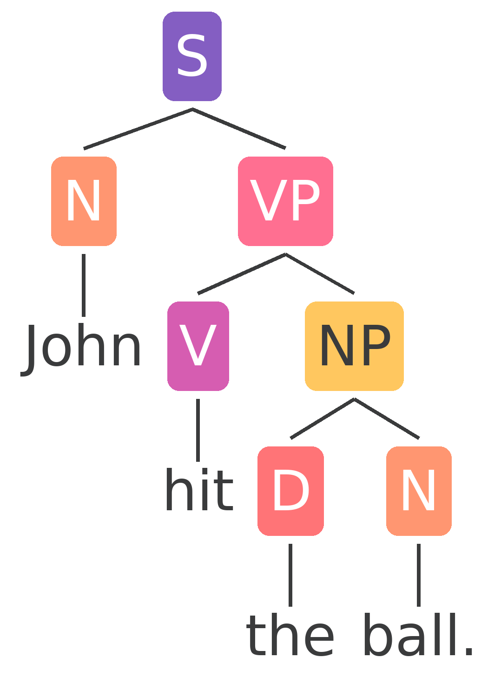

# syntree-gen
A constituency-based parse tree generator.

### Phrase markers
syntree-gen takes phrase markers as input. For example, the input `[S [N John] [VP [V hit] [NP [D the] [N ball.]]]]` will result in:
<p align="center">
    
</p>

### Installing prerequisites and running
```bash
pip install -r requirements.txt
python -OOm src -h
```